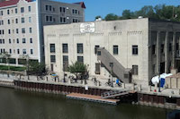

# Activities

## Harley Davidson Museum

[The Harley Davidson Museum](http://www.harley-davidson.com/) is a must-see for any motorcycle lovers.  Even if you prefer Hondas or Ducatis, seeing the evolution of the motorcycle through WW2 and into today is quite the sight.  With a little searching on Google, you're likely to find a coupon for the entry ticket.  Fun-fact: I used to work there.

## Milwaukee Art Museum

[MAM](http://mam.org/) is home to over 30,000 pieces of art. The Museum’s signature wings, the Burke Brise Soleil, form a moveable sunscreen with a 217-foot wingspan. Made up of 72 steel fins, and ranging in length from 26 to 105 feet, the entire structure weighs 90 tons. It takes 3.5 minutes for the wings to open at sunrise and close at dusk.

## Lakefront Brewery

[Lakefront Brewery](http://www.lakefrontbrewery.com/tour) is home to one of the most entertaining brewery tours in the Midwest.  Ladies compete for a chance to be the "bungqueen", answer trivial questions for drink tokens, and laugh with the tour guides as you learn about the craft of beer making.

## Milwaukee County Zoo

Everyone loves animals!  And you'll see your fill at the [Milwaukee Zoo](http://www.milwaukeezoo.org/). As one of the country’s finest zoological attractions, the Milwaukee County Zoo will educate, entertain and inspire you! Visit over 2,000 mammals, birds, fish, amphibians and reptiles in specialized habitats spanning 200 wooded acres. Explore educational wildlife shows, fun attractions and enticing special events.

## RiverWalk

The RiverWalk allows you to leisurely walk up and down the Milwaukee River.  If you get hungry you can pop into one of many restaurants, have a glass of wine or pint of beer. Enjoy the boats going by and relaxing atmosphere.  Make sure you stop and get a picture with the Bronze Fonz!

