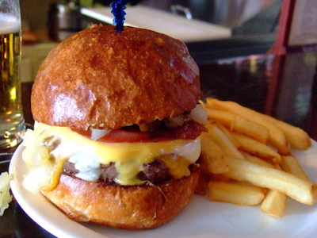
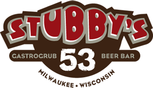
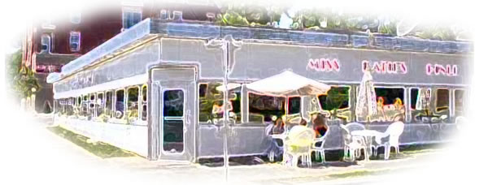

# Dining

## Burgers

Nothing accompanies a Miller Lite quite like a fresh burger.  [Food Wars](http://www.milwaukeefood.com/blog/?p=729) have raged across Milwaukee in search of the city's best burger.

### Sobelmans

Many claim that [Sobelmans](http://www.milwaukeesbestburgers.com/) is the true owner of the title "Milwaukee's Best Burgers".  Topped with three kinds of cheese, bacon, chopped onions, and jalapeños, a Sobelman burger leaves nothing to be desired.  The buns are crisped to perfection, allowing you to grip those meaty patties without worrying about anything sliding out the side.  They don't have the widest selection of beers, though since you're in Wisconsin they almost always have Spotten Cow on tap.  Residing in the valley south of Marquette University, Solbelmans quickly gained popularity amoung Marquette students.  In 2010 they opened up a second location on Marquette's campus, taking over Angelo's old pizza spot.

### AJ Bombers

Marketed as "Happiness, w/ a side of Burgers.", [AJ Bombers](http://ajbombers.com/) is the proud winner of the Travel Channel's FOOD WARS.  Their menu touts 'The Milwaukee Burger', 1/4lb of ground beef, local Wisconsin colby cheese, Berkshire bacon, all topped with irresistible Schlitz onions.  While the Milwaukee is the burger that won them FOOD WARS, the other burgers are also worth considering.  While many first scoff at the Barrie, most tend to enjoy the chunky 'pnut butter' bacon cheeseburger after trying it.

## American

It's hard to draw a line where the 'Burgers' category ends, and where 'American' begins, especially in Milwaukee.  The listings above are known for their burgers, whereas the ones below sell burgers but are more known for their general atmosphere and generally have a larger variety of items on their menus.

### Stubby's

[Stubby's Gastropub](http://stubbyspubandgrub.com/) serves up fresh meals made with locally-sourced ingredients.  Sporting a massive 53 ever-rotating beers-on-tap, you can enjoy a wide variety of beer.  If you're more of a beer aficionado, you might want to consider signing up for [Club 53](http://www.stubclub53.com/) where you can receive VIP beer tappings, beer dinner discounts, and more!  With a range of salads, sandwiches, and 'fill-ups', you're bound to find something to appease your palate.  As the evening rolls on, make sure to check out the giant Jenga set they have near the front entrance!

### Miss Katie's Diner

Tucked away just behind the Southwestern corner of Marquette University's campus, [Miss Katie's](http://www.miss-katies.com/) sits serving up locals the homecooked grub they've grown to love.  It also makes a good pre-basketball game spot, as they offer free shuttle service to all home Milwaukee Bucks & Marquette Men's Basketball games.

## Seafood

### Barnacle Bud's

[Barnacle Bud's](http://barnacle-buds.com/) is a bit of a hidden gem, not only because people don't know about it, but also because it's tucked behind some industrial buildings.  They have Bloody Marys, an outdoor oyster bar, and have been voted Milwaukee's best spot for day drinking!

