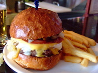

# Dining

## Burgers

Nothing accompanies a Miller Lite quite like a fresh burger.  [Food Wars](http://www.milwaukeefood.com/blog/?p=729) have raged across Milwaukee in search of the city's best burger.

### Sobelmans

Many claim that [Sobelmans](http://www.milwaukeesbestburgers.com/) is the true owner of the title "Milwaukee's Best Burgers".  Topped with three kinds of cheese, bacon, chopped onions, and jalapeños, a Sobelman burger leaves nothing to be desired.  The buns are crisped to perfection, allowing you to grip those meaty patties without worrying about anything sliding out the side.  They don't have the widest selection of beers, though since you're in Wisconsin they almost always have Spotten Cow on tap.  Residing in the valley south of Marquette University, Solbelmans quickly gained popularity amoung Marquette students.  In 2010 they opened up a second location on Marquette's campus, taking over Angelo's old pizza spot.

### AJ Bombers

Marketed as "Happiness, w/ a side of Burgers.", [AJ Bombers](http://ajbombers.com/) is the proud winner of the Travel Channel's FOOD WARS.  Their menu touts 'The Milwaukee Burger', 1/4lb of ground beef, local Wisconsin colby cheese, Berkshire bacon, all topped with irresistible Schlitz onions.  While the Milwaukee is the burger that won them FOOD WARS, the other burgers are also worth considering.  While many first scoff at the Barrie, most tend to enjoy the chunky 'pnut butter' bacon cheeseburger after trying it.

