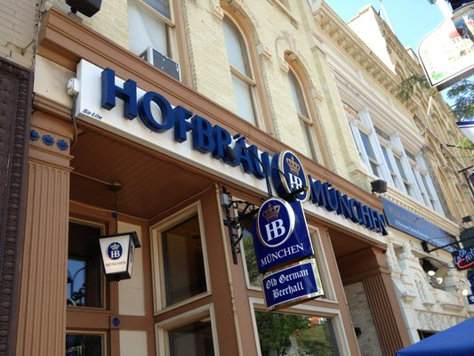

# Drinks

## Bars

### Old German Beer Hall

[Old German Beer Hall](http://www.oldgermanbeerhall.com/), aka OGBH, aka Hofbräuhaus Milwaukee, brings the Munich feel to Old World Third Street in Milwaukee.  Why order beer by the pint when you can get it by the liter?  Grab a glass [stein](http://en.wikipedia.org/wiki/Beer_stein), get some nails for a round of [hammerschlagen](http://en.wikipedia.org/wiki/Hammerschlagen), and make sure the loser pays for the [shotski](http://www.esquire.com/cm/esquire/images/old-german-beer-lg.jpg).  The bartenders are beyond friendly, and are more than willing to explain the different beers if you're only used to locals like Miller.  If you get hungry you can order up a knackwurst, deep fried cheese curds, or a pretzel with beer cheese to dip it in.  It may look small from the ouside, but there is plenty of room in the back with their long beer-hall tables!  Prost!

