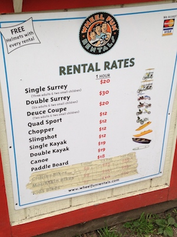
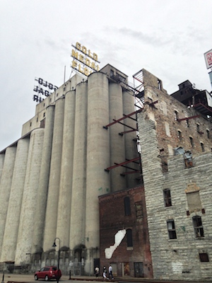

# Activities

## Outdoor

### Lake Nokomis

[Lake Nokomis](http://www.minneapolisparks.org/?PageID=4&parkid=257) is a beautiful lake on the South end of Minneapolis.  There are two public beaches, and an area to rent paddle boards, canoes, kayaks, and more!  Surrounding the lake is a 2.78 mile walking path, which is conveniently separated from the bike path, where riders can go faster without worrying about crashing into a slower walker.  There is also a small food stand, which is currently expanding and will soon offer beer and wine!

## Indoors

### Mill City Museum

Did you know that Minneapolis experienced an economic boom due to flour mills along the Mississippi river?  The [Mill City Museum](http://www.millcitymuseum.org/) actually resides within a previously active mill, which suffered destruction due to an explosion in 1878.  Resonably priced, adults and children can see the old machinery up close, and there are even baking classrooms where you can make "samples"!

