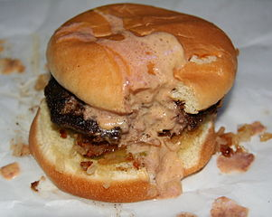
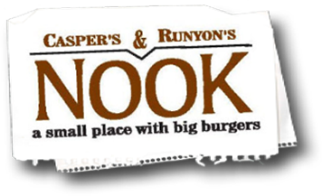
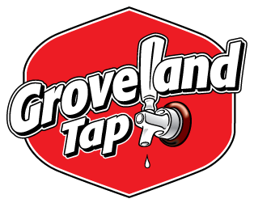
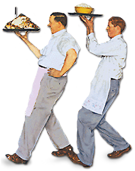
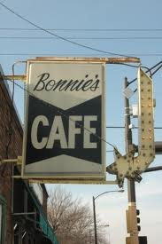
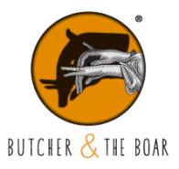

# Dining

## Jucy Lucy

[Jucy Lucys](http://en.wikipedia.org/wiki/Jucy_Lucy) practically deserve a whole page of their own.  Invented and perfected in the great city of Minneapolis, molten cheese magma stuffed inside of a ground beef patty never tasted so good.  There are a variety of establishments that serve variations of the Lucy, though [Matt's Bar](http://mattsbar.com/) and the [5-8 Club](http://www.5-8club.com/) both claim to have invited the original.  While the list below isn't a list of everywhere in town you can get get a stuffed burger, it is a curated list of my top favorites.

### Matt's Bar

[Matt's](http://mattsbar.com/) is no-frills kind of place.  Their menu is simple: a Jucy Lucy, or anything you can make with a combination of bread, meat, and cheese: grilled cheese, hamburger, cheeseburger, or fries.  Typically only two people work there, one waitress and the man running the grill, though on a busier night you might be lucky enough to have a third person running the bar.  Don't expect any sort of variations of the Lucy, you can order the original and that's it.  And you better bring cash, because they don't accept plastic.  "Remember, if it is spelled correctly, you are eating a shameless rip-off!"

### 5-8 Club

Not the be confused with [Bar 508](http://www.bar508.com/), the [5-8 Club](http://www.5-8club.com/) serves up the Juicy Lucy with American, Amablu Blue, Petter, or Swiss cheese.  They have three locations scattered around Minnesota.  If you want to try something a little different, you can also order up the Saucy Sally, which claims to be "Lucy's younger sister".  They also have a full menu, so if you're with a crowd you'll probably have an easier time pleasing everyone here rather than with the limited menu at Matt's.

### The Nook

[Casper's & Runyon's Nook](http://www.crnook.com/) doesn't primarily focus on Jucy Lucys, but that doesn't stop them from having a few stuffed burgers on their menu.  The Juicy Nookie, Paul Molitor, The Spanish Fly, Stuffed Philly Cheeseburger, and Guys Big Bite all adorn their menu.  They also have a full menu to please anyone who may be joining you on your dinner adventure.  If you're lucky enough to be sat downstairs, you'll enjoy the view of an old-school, keep-your-own-score, underground bowling alley.  Count the dollar bills on the ceiling while chowing down in a burried old-timey diner.

### Groveland Tap

The [Tap](http://www.grovelandtap.com/) is one hell of a watering hole.  Every square inch of wallspace is covered with tap handles of domestic and foreign beers that they either are currently serving, or served in the past.  While they do serve a 'traditional' Juicy Lucy, they're more famous for the Ellsworth: a Lucy topped with deep friend cheese curds and smothered in Tap Sauce.  What is Tap Sauce?  No one can be too sure, but it's way better than any secret sauce you'll get a McDonalds.

## Breakfast

Looking for something to cure that hangover?  Not much beats the taste of a greasy diner meal.  Living on the edge of the Twin Cities, a few diners serve up what the doctor ordered to get you back into tip-top shape.

### Keys Cafe & Bakery

While there are a few [Keys Cafes](http://www.keyscafe.com/) scattered around the Twin Cities, the original lies on Raymond Avenue in Saint Paul.  An easy-going seat-yourself kind of place, you'll feel comfortable even if you're still in last night's cloths.  Everything is delicious, though some consider it a sin to leave without ordering a caramel or cinnamon roll.  From omlets to french toast, steak sandwhiches to turkey burgers, they have anything your dreary-eyed self could desire.  Make sure to not dilly-dally too long though, as they close up shop at 2pm!

### Bonnie's Cafe

As one wise man on Yelp put it, "Sometimes I can't fall asleep and I stare at my ceiling while imaginging all the meals I would cook if I weren't a lazy man. Thank fuck that Bonnie's opens at 5:30am."  Yes, Bonnie's opens a full 30 minutes before Keys Cafe, and they're more than happy to serve blue collar individuals waking up well before dawn.  Like Matt's bar, they really have an old-timey feel.  Also like Matt's bar, it's a cash only place.  Get in, chown down, get out, get on with your day.  Bonnie's is so retro, they don't even have a website.  They serve up homemade salsa, which goes extremely well with the chorizo scrambler.  If you have time to sip your coffee and scroll through the morning's paper, this is the place you need to be.

## American

### George & the Dragon

While it doesn't house any mythical beasts, [George & the Dragon](http://www.ganddpub.com/) is home to some great American style food as well as some great draught beers.  About half of the drinks on tap are from local breweries, and if you're feeling lucky you can always go with "Mr. Miller's Pick", just hope he's in a good mood to get you something good.  G&D prides themselves on "Pub Classis & Family Recipes", making sure to mix in some humor with "God Save the Green", the salad section of their menu.  The pretzel bread with homemade butter is as amazing as it sounds, and you'll never be hungry after the Dragon's Milk Braised Beef Rib.

### Brasa

[Brasa](http://www.brasa.us/) is the perfect place to share stories and plates of food with some of your best friends.  The two locations have slightly different menus, so make sure you're looking at the correct one before you set out.  The menu is broken up into five sections: proteins, sides, bowls, breads, and sandwiches.  Mix and match, take turns picking around the table, and pass it all around when it's served.  For those with some dietary restrictions, they also have a gluten free menu.

### Butcher & the Boar

The [Butcher and the Board](http://butcherandtheboar.com/) is home to some great cured and prepared meats.  Duck Breast, Double Cut Berksire Pork Chop, Rooster Rillette, Wild Board Hot Link, Green Chorizo... the list never ends.  At the West end of downtown Minneapolis, you're just a straight shot up Hennepin Ave away from a plethora of bars and night clubs.  While it is a bit higher up on the price scale, meat lovers will find a small slice of heaven on B&tB's menu.

