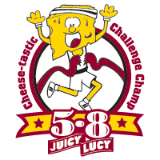

# Dining

## Jucy Lucy

[Jucy Lucys](http://en.wikipedia.org/wiki/Jucy_Lucy) practically deserve a whole page of their own.  Invented and perfected in the great city of Minneapolis, molten cheese magma stuffed inside of a ground beef patty never tasted so good.  There are a variety of establishments that serve variations of the Lucy, though [Matt's Bar](http://mattsbar.com/) and the [5-8 Club](http://www.5-8club.com/) both claim to have invited the original.  While the list below isn't a list of everywhere in town you can get get a stuffed burger, it is a curated list of my top favorites.

### Matt's Bar

[Matt's](http://mattsbar.com/) is no-frills kind of place.  Their menu is simple: a Jucy Lucy, or anything you can make with a combination of bread, meat, and cheese: grilled cheese, hamburger, cheeseburger, or fries.  Typically only two people work there, one waitress and the man running the grill, though on a busier night you might be lucky enough to have a third person running the bar.  Don't expect any sort of variations of the Lucy, you can order the original and that's it.  And you better bring cash, because they don't accept plastic.  "Remember, if it is spelled correctly, you are eating a shameless rip-off!"

### 5-8 Club

Not the be confused with [Bar 508](http://www.bar508.com/), the [5-8 Club](http://www.5-8club.com/) serves up the Juicy Lucy with American, Amablu Blue, Petter, or Swiss cheese.  They have three locations scattered around Minnesota.  If you want to try something a little different, you can also order up the Saucy Sally, which claims to be "Lucy's younger sister".  They also have a full menu, so if you're with a crowd you'll probably have an easier time pleasing everyone here rather than with the limited menu at Matt's.

### The Nook

[Casper's & Runyon's Nook](http://www.crnook.com/) doesn't primarily focus on Jucy Lucys, but that doesn't stop them from having a few stuffed burgers on their menu.  The Juicy Nookie, Paul Molitor, The Spanish Fly, Stuffed Philly Cheeseburger, and Guys Big Bite all adorn their menu.  They also have a full menu to please anyone who may be joining you on your dinner adventure.  If you're lucky enough to be sat downstairs, you'll enjoy the view of an old-school, keep-your-own-score, underground bowling alley.  Count the dollar bills on the ceiling while chowing down in a burried old-timey diner.

### Groveland Tap

The [Tap](http://www.grovelandtap.com/) is one hell of a watering hole.  Every square inch of wallspace is covered with tap handles of domestic and foreign beers that they either are currently serving, or served in the past.  While they do serve a 'traditional' Juicy Lucy, they're more famous for the Ellsworth: a Lucy topped with deep friend cheese curds and smothered in Tap Sauce.  What is Tap Sauce?  No one can be too sure, but it's way better than any secret sauce you'll get a McDonalds.

## American
