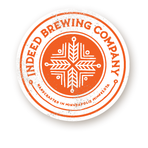

# Drinks

## Breweries

Minnesota has had a recent surge of breweries, and the uprising of craft beer has no end in sight.  The state has some conservative liquor laws, and while alcohol still [can't be sold on Sundays](http://en.wikipedia.org/wiki/Alcohol_laws_of_the_United_States#Michigan.E2.80.93New_Mexico), the ["Surly Bill"](http://en.wikipedia.org/wiki/Surly_Brewing_Company#History) signed in 2011 allows breweries to sell beer on-site in establishments such as [brewpubs](http://en.wikipedia.org/wiki/Brewpub#Brewpub).  While they don't serve food, many have food trucks that visit and sell a variety of foods that can be eaten while you enjoy your fresh brew.

### Surly

"It's never too early to get [Surly](http://www.surlybrewing.com/)."  Credited as being the guys who [overturned laws](http://blogs.citypages.com/food/2011/05/surly_bill_is_law.php) that restricted local breweries from being able to brew and sell their beer on their own premises.  Rumor has it they threatened to move to Wisconsin if legislation wouldn't change the law.  Whether or not it's true, Surly is a fan favorite and local legend.  In stores you can find their beer in 4-packs of tallboys, because 12 ounces is never enough for one sitting.  If you go on one of their [brewery tours](http://www.surlybrewing.com/index.php?id=68), you'll hear how their flagship beer, Furious, was never intended to be.

### Barley John's

With tap handles that look more like glass bongs than beer identifiers, [Barly John's Brew Pub](http://www.barleyjohns.com/) has a unique small town feel to it.  You'll often find regulars sitting at the short bar, and the brewmaster is always happy to tell you about his latest creations.  Speaking of those brews, they're cheap.  Only $3.50 a pint!  If you're feeling hungry, they have a full resturaunt next to the bar.  Next to the bar are tables cut straight from a tree with cribbage boards built in.

### Dangerous Man

Brewed in the heart in NordEast Minneapolis, [Dangerous Man](http://www.dangerousmanbrewing.com/) makes high quality beer in small batches to allow for ever-changing taps.  Like most brewpubs they don't serve food, but they are in extremely close proximity to [Element Pizza](http://www.elementpizza.com/), [Maeve's](http://maeves.com/), and [Anchor Fish & Chips](http://www.theanchorfishandchips.com/).  They're very open to bringing in food from the outside, with the slogan, "We love food, we just don't make it."  While their logo is of a bearded man, they welcome all, hairy-faced or otherwise.

### Indeed Brewing Company

[Indeed](http://www.indeedbrewing.com/) is indeed a bit nutty.  One of their flagship beers, [Midnight Ryder](http://www.indeedbrewing.com/beers/midnight-ryder/), is adorned with a fat mustached man wearing a monocle and tophat, riding a bear.  Oh, and the bear appears to have a telescope in his eye.  Their brewpub is housed in an industrial park along with some artist lofts that participate in the yearly [Art a Whirl](http://nemaa.org/art-a-whirl).  They have a fenced in 900 square feet outdoor patio where you can sit and drink in the evening air.  [Potter's Pasties](http://www.potterspasties.com/) is a food truck that regularly visits, and their pies stick-to-your-ribs in a way only homecooked meals can.

## Bars

Those who can't do, brew.  Those who can't brew just sell stuff someone else made.  That's not to say any of these following bars should be looked down upon.  On the contrary, they're all unique and amazing in their own way.

### The News Room

Ever want to sit at a bar made out of a small pirate ship?  If so, [The News Room](http://thenewsroommpls.com/) should be on your radar.  If you order top shelf liquor, the bartenders have to scale the rope ladder on the side of the ship just to get it for you.  Be careful at the bow, as the bar isn't completely level and you can easily knock your off-balance drink over.  The bathrooms feel like a funhouse filled with mirrors, and it gets even more intense after a few rounds.  Neither the men's nor women's restrooms are marked, and the fact that they are both at the end of a zig-zag-y hallway doesn't make it any easier to tell them apart.  Being in downtown means the drinks are a little more expensive, but if you feel like barhopping it is a great place to start your night!

